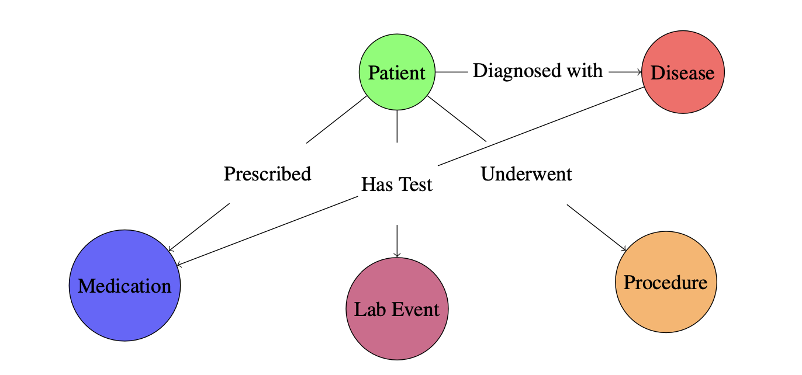
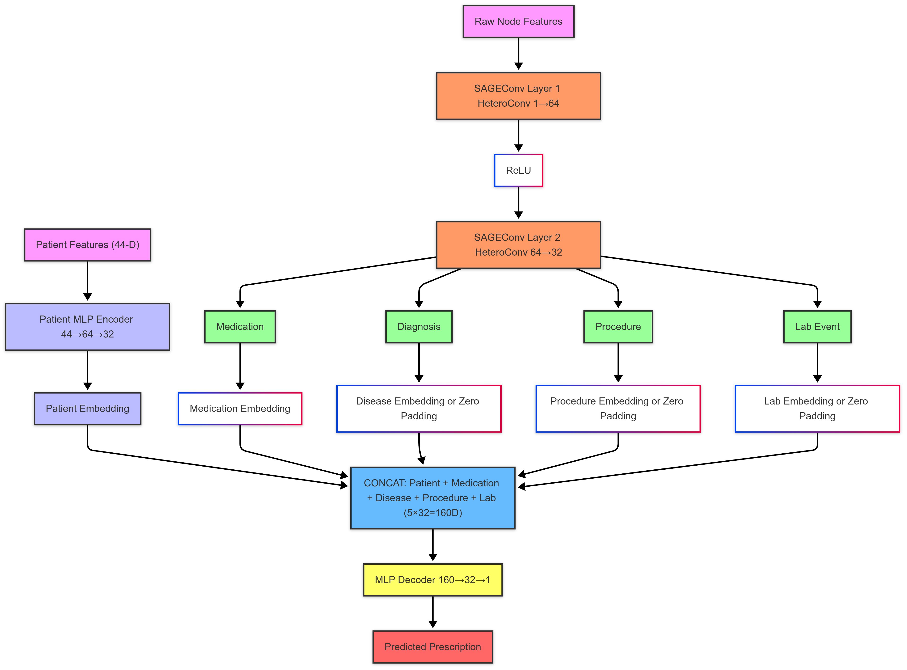
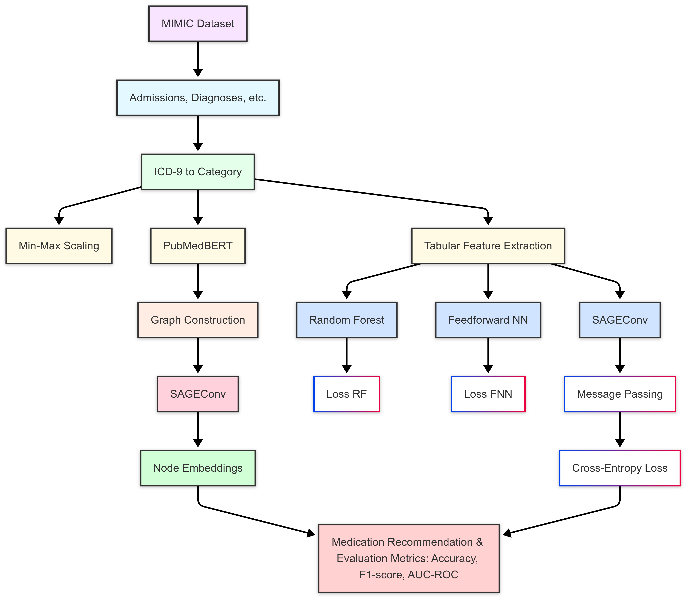

# Personalized Medicine Recommendations Using Graph Neural Networks

## 📌 Project Overview
This project explores the application of **Graph Neural Networks (GNNs)**, specifically **Graph Attention Networks (GATs)**, to **personalized medicine recommendations**. We utilize the **MIMIC-III** dataset to construct a **heterogeneous graph** representing patient histories, diagnoses, procedures, laboratory test results, and prescribed medications. Our goal is to develop an AI-driven **clinical decision support system** that recommends personalized treatments based on patient medical records.

## 📂 Dataset: MIMIC-III
We use the **MIMIC-III** (Medical Information Mart for Intensive Care) dataset, which contains de-identified **electronic health records (EHRs)** from ICU patients at Beth Israel Deaconess Medical Center. The following tables are used:

| Table Name        | Selected Columns |
|------------------|------------------------------------------------------|
| **PATIENTS**     | `subject_id`, `gender`, `dob`, `dod` (for age calculation) |
| **ADMISSIONS**   | `subject_id`, `hadm_id`, `admittime`, `dischtime`, `ethnicity` |
| **DIAGNOSES_ICD** | `subject_id`, `hadm_id`, `icd9_code`, `disease_category` (mapped using CCS) |
| **PROCEDURES_ICD** | `subject_id`, `hadm_id`, `icd9_code`, `procedure_category` (mapped using CCS) |
| **LABEVENTS**    | `subject_id`, `hadm_id`, `itemid`, `valuenum` (normalized using MinMaxScaler) |
| **PRESCRIPTIONS** | `subject_id`, `hadm_id`, `drug`, **PubMedBERT-encoded embeddings** |

## 🛠️ Data Preprocessing
To prepare the dataset for graph-based modeling, the following preprocessing steps were applied:

1. **ICD-9 Disease and Procedure Mapping**  
   - **Diagnoses (`icd9_code`)** and **procedures (`icd9_code`)** are mapped to **higher-level categories** using **HCUP Clinical Classifications Software (CCS)**.
   - This reduces the sparsity of disease/procedure codes and improves model interpretability.

2. **Medication Normalization**  
   - Medication names from the **PRESCRIPTIONS** table are encoded using **PubMedBERT** embeddings.
   - These embeddings capture **semantic relationships** between drugs, improving the recommendation system.

3. **Laboratory Test Normalization**  
   - The `valuenum` column in the **LABEVENTS** table is **normalized** using `MinMaxScaler` to ensure consistency across different test types.

4. **Graph Construction (Planned)**  
   - The heterogeneous graph will consist of **nodes** (patients, diseases, medications, procedures, lab events) and **edges** capturing medical interactions (e.g., `diagnosed_with`, `prescribed`, `underwent`, `has_test`).

## 📌 Planned Steps: Graph Construction and Model Training

1. **Graph Construction**  
   - Construct a **heterogeneous knowledge graph** using PyTorch Geometric.
   - Define **node embeddings** for patients, diseases, medications, and lab events.
   - Convert the graph to an **undirected format** to improve message passing.

2. **GAT Model Training (Upcoming)**  
   - Implement **Graph Attention Networks (GAT)** to learn relationships in the medical graph.
   - Use **multi-head attention** to weigh different medical interactions.
   - Train using **cross-entropy loss** with **mini-batch training**.

3. **Evaluation and Baselines**  
   - Compare GAT against **logistic regression, random forest, and MLP classifiers**.
   - Use **precision, recall, F1-score, and AUC-ROC** for performance evaluation.
   - Conduct **ablation studies** to analyze the impact of different features.

## 📊 Graphical Representation

A **heterogeneous medical graph** will be used to model the relationships between entities:



- **Nodes:** Patients, Diseases, Medications, Procedures, Lab Events  
- **Edges:** `Diagnosed_with`, `Prescribed`, `Underwent`, `Has_Test` 

## HeteroGNN Architecture



## Workflow Diagram



## 🚀 Folder Structure of The App
```
├── Dockerfile
├── app
│   ├── __init__.py
│   ├── __pycache__
│   │   ├── __init__.cpython-311.pyc
│   │   ├── settings.cpython-311.pyc
│   │   ├── urls.cpython-311.pyc
│   │   └── wsgi.cpython-311.pyc
│   ├── asgi.py
│   ├── settings.py
│   ├── urls.py
│   └── wsgi.py
├── db.sqlite3
├── docker-compose.yml
├── manage.py
├── predictor
│   ├── __init__.py
│   ├── __pycache__
│   │   ├── __init__.cpython-311.pyc
│   │   ├── admin.cpython-311.pyc
│   │   ├── apps.cpython-311.pyc
│   │   ├── model.cpython-311.pyc
│   │   ├── models.cpython-311.pyc
│   │   ├── urls.cpython-311.pyc
│   │   └── views.cpython-311.pyc
│   ├── admin.py
│   ├── apps.py
│   ├── migrations
│   │   ├── __init__.py
│   │   └── __pycache__
│   │       └── __init__.cpython-311.pyc
│   ├── model
│   │   ├── admission_type_mapping.json
│   │   ├── best_f1_model.pth
│   │   ├── column_index.json
│   │   ├── disease_category_mapping.json
│   │   ├── ethnicity_mapping.json
│   │   ├── labtests 2.json
│   │   ├── labtests.json
│   │   ├── mlb_encoder.pkl
│   │   ├── procedure_category_mapping.json
│   │   └── scaler_valuenum_labevents.pkl
│   ├── model.py
│   ├── models.py
│   ├── templates
│   │   └── predictor
│   │       ├── backup.html
│   │       ├── home.html
│   │       └── predict.html
│   ├── tests.py
│   ├── urls.py
│   └── views.py
└── requirements.txt
```

### How to run the app

#### Install dependencies

Go to the app directory under Lite Version and run:

```
   pip install -r requirements.txt
```

#### Run the Django application
```
   python3 manage.py runserver
```

### Future Work

* Temporal Modeling: Incorporate sequential information (e.g., disease progression, lab trends) to better reflect real-world clinical timelines.

* Cross-Dataset Evaluation: Validate the model's generalizability across different healthcare datasets and patient populations.

* Model Interpretability: Integrate explainability tools such as attention heatmaps or decision rationale tracing to support clinical trust and adoption.

### 📜 Citation

If you use this work, please cite:

```bibtex
@article{Johnson2016mimic,
  author  = {Alistair EW Johnson and Tom J Pollard and Lu Shen and et al.},
  title   = {MIMIC-III, a freely accessible critical care database},
  journal = {Scientific Data},
  volume  = {3},
  pages   = {160035},
  year    = {2016}
}

@inproceedings{hamilton2017inductive,
  title     = {Inductive Representation Learning on Large Graphs},
  author    = {Hamilton, William L. and Ying, Rex and Leskovec, Jure},
  booktitle = {Advances in Neural Information Processing Systems (NeurIPS)},
  year      = {2017},
  url       = {https://arxiv.org/abs/1706.02216}
}
```